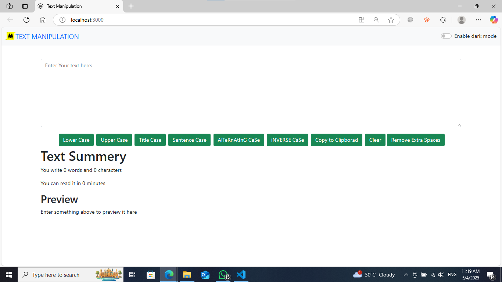

## text-manipulation-app
React-based text utility that allows to manipulate text in real time. It includes features like dark mode, live word/character count, reading time estimation, and a preview panel.

## Installation
Clone the repository and install dependencies:
```bash
git clone https://github.com/Muhammad-Yaqoob-4110/text-manipulation-app.git
```

```
cd text-manipulation-app
```

```
npm install
```

## Run the Development Server
Start the development server with:
```
npm start
```
Then visit http://localhost:3000 in your browser.

## Contributing
Contributions are welcome! To contribute:
- Fork the repository.
- Make your changes.
- Commit and push.
- Create a pull request.


## How It Looks?


## License
This project is licensed under the [MIT License](LICENSE).